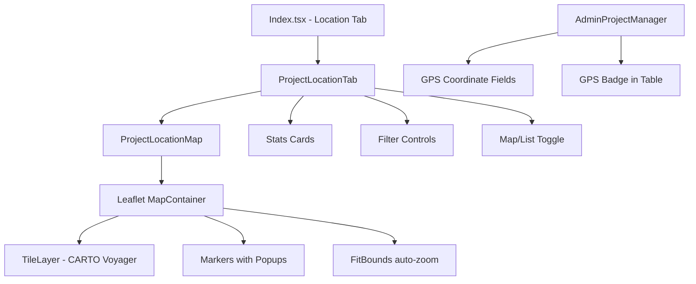

# Project Location — Frontend Implementation

## Summary

Implemented the full **Project Location** feature on the frontend, replacing the placeholder "coming soon" message with an interactive map and project listing interface.

## Changes Made

### 1. New Components

#### 📍 [ProjectLocationMap.tsx](file:///c:/Users/ICTO/OneDrive/Documents/GitHub/bungoma-project-insights/src/components/dashboard/ProjectLocationMap.tsx)
[ProjectLocationMap.tsx](file:///c:/Users/ICTO/OneDrive/Documents/GitHub/bungoma-project-insights/src/components/dashboard/ProjectLocationMap.tsx)

- Interactive **Leaflet map** displaying project markers
- **Colour-coded markers** by project status:
  - 🟢 Green = Completed
  - 🔵 Blue = Ongoing
  - 🔴 Red = Stalled
- **Popup details** on marker click showing: name, status, sector, location, budget, progress, and FY
- **Auto-fit bounds** to show all markers in view
- **Highlight/pan** feature — clicking a project in the sidebar pans the map to that marker
- **Legend** overlay and **mapped count badge**

#### 📋 [ProjectLocationTab.tsx](file:///c:/Users/ICTO/OneDrive/Documents/GitHub/bungoma-project-insights/src/components/dashboard/ProjectLocationTab.tsx)
[ProjectLocationTab.tsx](file:///c:/Users/ICTO/OneDrive/Documents/GitHub/bungoma-project-insights/src/components/dashboard/ProjectLocationTab.tsx)

- **Summary stats cards**: Total projects, GPS mapped count, unmapped count, sub-county count
- **Filter controls**: Search by name/ward/sub-county, filter by sub-county, filter by status
- **Map + List toggle**: Switch between interactive map view and flat list view
- **Map view** sidebar: Projects grouped by sub-county with GPS indicators
- **List view**: Full project listing with GPS coordinates, status badges, and Google Maps links
- **GPS Coverage chart**: Distribution bar showing mapping completion by sub-county

### 2. Modified Files

#### [AdminProjectManager.tsx](file:///c:/Users/ICTO/OneDrive/Documents/GitHub/bungoma-project-insights/src/components/admin/AdminProjectManager.tsx)
```diff:AdminProjectManager.tsx
import { useState } from "react";
import { useQuery, useMutation, useQueryClient } from "@tanstack/react-query";
import { Card, CardContent, CardHeader, CardTitle, CardDescription } from "@/components/ui/card";
import { Button } from "@/components/ui/button";
import { Input } from "@/components/ui/input";
import { Table, TableBody, TableCell, TableHead, TableHeader, TableRow } from "@/components/ui/table";
import { Badge } from "@/components/ui/badge";
import { Select, SelectContent, SelectItem, SelectTrigger, SelectValue } from "@/components/ui/select";
import { Dialog, DialogContent, DialogHeader, DialogTitle, DialogFooter } from "@/components/ui/dialog";
import { Textarea } from "@/components/ui/textarea";
import { Checkbox } from "@/components/ui/checkbox";
import { Search, Plus, Pencil, Trash2, Loader2, Upload, MapPin } from "lucide-react";
import { toast } from "sonner";
import { fetchProjects, createProject, updateProject, deleteProject, bulkUpdateProjectLocation, SUB_COUNTIES, SECTORS, STATUSES, FINANCIAL_YEARS, getWards } from "@/data/projects";
import type { Project } from "@/data/projects";
import CsvProjectImport from "./CsvProjectImport";

type ProjectFormData = {
  name: string;
  description: string;
  sub_county: string;
  ward: string;
  sector: string;
  status: "Completed" | "Ongoing" | "Stalled";
  fy: string;
  budget: number;
  progress: number;
  projected_cost: number | null;
  actual_spend: number;
};

const emptyForm: ProjectFormData = {
  name: "",
  description: "",
  sub_county: "",
  ward: "",
  sector: "",
  status: "Ongoing",
  fy: "",
  budget: 0,
  progress: 0,
  projected_cost: null,
  actual_spend: 0,
};

export default function AdminProjectManager() {
  const queryClient = useQueryClient();
  const [searchTerm, setSearchTerm] = useState("");
  const [dialogOpen, setDialogOpen] = useState(false);
  const [editingProject, setEditingProject] = useState<Project | null>(null);
  const [form, setForm] = useState<ProjectFormData>(emptyForm);
  const [deleteId, setDeleteId] = useState<string | null>(null);
  const [csvOpen, setCsvOpen] = useState(false);
  const [selectedIds, setSelectedIds] = useState<string[]>([]);
  const [bulkLocationOpen, setBulkLocationOpen] = useState(false);
  const [bulkLocationForm, setBulkLocationForm] = useState({ sub_county: "", ward: "" });

  const { data: projects = [], isLoading } = useQuery({
    queryKey: ["projects"],
    queryFn: fetchProjects,
  });

  const saveMutation = useMutation({
    mutationFn: async (data: ProjectFormData) => {
      if (editingProject) {
        return updateProject(editingProject.id, data);
      }
      return createProject(data);
    },
    onSuccess: () => {
      queryClient.invalidateQueries({ queryKey: ["projects"] });
      toast.success(editingProject ? "Project updated" : "Project created");
      closeDialog();
    },
    onError: (err: Error) => toast.error(err.message),
  });

  const deleteMutation = useMutation({
    mutationFn: deleteProject,
    onSuccess: () => {
      queryClient.invalidateQueries({ queryKey: ["projects"] });
      toast.success("Project deleted");
      setDeleteId(null);
    },
    onError: (err: Error) => toast.error(err.message),
  });

  const bulkLocationMutation = useMutation({
    mutationFn: () => bulkUpdateProjectLocation(selectedIds, bulkLocationForm.sub_county, bulkLocationForm.ward),
    onSuccess: () => {
      queryClient.invalidateQueries({ queryKey: ["projects"] });
      toast.success("Projects locations updated successfully");
      setBulkLocationOpen(false);
      setSelectedIds([]);
      setBulkLocationForm({ sub_county: "", ward: "" });
    },
    onError: (err: Error) => toast.error(err.message),
  });

  const toggleSelectAll = () => {
    if (selectedIds.length === filtered.length && filtered.length > 0) {
      setSelectedIds([]);
    } else {
      setSelectedIds(filtered.map((p) => p.id));
    }
  };

  const toggleSelect = (id: string) => {
    if (selectedIds.includes(id)) {
      setSelectedIds(selectedIds.filter((i) => i !== id));
    } else {
      setSelectedIds([...selectedIds, id]);
    }
  };

  const filtered = projects.filter(
    (p) =>
      p.name.toLowerCase().includes(searchTerm.toLowerCase()) ||
      p.sub_county.toLowerCase().includes(searchTerm.toLowerCase()) ||
      p.sector.toLowerCase().includes(searchTerm.toLowerCase())
  );

  const openCreate = () => {
    setEditingProject(null);
    setForm(emptyForm);
    setDialogOpen(true);
  };

  const openEdit = (project: Project) => {
    setEditingProject(project);
    setForm({
      name: project.name,
      description: project.description || "",
      sub_county: project.sub_county,
      ward: project.ward,
      sector: project.sector,
      status: project.status,
      fy: project.fy,
      budget: project.budget,
      progress: project.progress,
      projected_cost: project.projected_cost ?? null,
      actual_spend: Number(project.actual_spend ?? 0),
    });
    setDialogOpen(true);
  };

  const closeDialog = () => {
    setDialogOpen(false);
    setEditingProject(null);
    setForm(emptyForm);
  };

  const handleSubmit = (e: React.FormEvent) => {
    e.preventDefault();
    if (!form.name || !form.sub_county || !form.ward || !form.sector || !form.fy) {
      toast.error("Please fill all required fields");
      return;
    }
    saveMutation.mutate(form);
  };

  const statusColor = (s: string) => {
    if (s === "Completed") return "bg-emerald-500/10 text-emerald-600";
    if (s === "Ongoing") return "bg-blue-500/10 text-blue-600";
    return "bg-amber-500/10 text-amber-600";
  };

  const wards = getWards(form.sub_county);

  return (
    <div className="space-y-6">
      <div className="flex flex-col sm:flex-row justify-between items-start sm:items-center gap-4">
        <div>
          <h2 className="text-2xl font-bold tracking-tight">Project Management</h2>
          <p className="text-muted-foreground text-sm">Add, edit, and manage all county projects.</p>
        </div>
        <div className="flex gap-2 shrink-0">
          <Button variant="outline" onClick={() => setCsvOpen(true)} className="gap-2">
            <Upload className="w-4 h-4" /> Import CSV
          </Button>
          <Button onClick={openCreate} className="gap-2">
            <Plus className="w-4 h-4" /> Add Project
          </Button>
        </div>
      </div>

      <Card className="border-border shadow-sm">
        <CardHeader>
          <div className="flex flex-col sm:flex-row justify-between items-start sm:items-center gap-4">
            <div>
              <CardTitle>All Projects ({projects.length})</CardTitle>
              <CardDescription>Manage the complete project registry.</CardDescription>
            </div>
            <div className="flex flex-col sm:flex-row gap-3 w-full sm:w-auto">
              {selectedIds.length > 0 && (
                <Button 
                  variant="secondary" 
                  onClick={() => setBulkLocationOpen(true)}
                  className="gap-2 bg-blue-50 text-blue-600 hover:bg-blue-100 border border-blue-200"
                >
                  <MapPin className="w-4 h-4" />
                  Update Location ({selectedIds.length})
                </Button>
              )}
              <div className="relative w-full sm:w-72">
                <Search className="absolute left-2.5 top-2.5 h-4 w-4 text-muted-foreground" />
                <Input
                  type="search"
                  placeholder="Search projects..."
                  className="pl-8"
                  value={searchTerm}
                  onChange={(e) => setSearchTerm(e.target.value)}
                />
              </div>
            </div>
          </div>
        </CardHeader>
        <CardContent>
          {isLoading ? (
            <div className="flex justify-center py-12">
              <Loader2 className="w-6 h-6 animate-spin text-primary" />
            </div>
          ) : (
            <div className="rounded-md border border-border">
              <Table>
                <TableHeader className="bg-muted/50">
                  <TableRow>
                    <TableHead className="w-[40px] text-center">
                      <Checkbox 
                        checked={filtered.length > 0 && selectedIds.length === filtered.length}
                        onCheckedChange={toggleSelectAll}
                        aria-label="Select all"
                      />
                    </TableHead>
                    <TableHead>Project Name</TableHead>
                    <TableHead>Sub-County</TableHead>
                    <TableHead>Sector</TableHead>
                    <TableHead>Status</TableHead>
                    <TableHead>Budget (KES)</TableHead>
                    <TableHead>Progress</TableHead>
                    <TableHead className="text-right">Actions</TableHead>
                  </TableRow>
                </TableHeader>
                <TableBody>
                  {filtered.length === 0 ? (
                    <TableRow>
                      <TableCell colSpan={8} className="text-center h-24 text-muted-foreground">
                        No projects found.
                      </TableCell>
                    </TableRow>
                  ) : (
                    filtered.map((project) => (
                      <TableRow key={project.id}>
                        <TableCell>
                          <Checkbox 
                            checked={selectedIds.includes(project.id)}
                            onCheckedChange={() => toggleSelect(project.id)}
                            aria-label={`Select ${project.name}`}
                          />
                        </TableCell>
                        <TableCell>
                          <div className="flex flex-col">
                            <span className="font-medium text-sm">{project.name}</span>
                            <span className="text-xs text-muted-foreground">{project.ward} • {project.fy}</span>
                          </div>
                        </TableCell>
                        <TableCell className="text-sm">{project.sub_county}</TableCell>
                        <TableCell className="text-sm max-w-[150px] truncate">{project.sector}</TableCell>
                        <TableCell>
                          <Badge variant="secondary" className={statusColor(project.status)}>
                            {project.status}
                          </Badge>
                        </TableCell>
                        <TableCell className="text-sm font-mono">
                          {Number(project.budget).toLocaleString()}
                        </TableCell>
                        <TableCell>
                          <div className="flex items-center gap-2">
                            <div className="h-1.5 w-16 bg-muted rounded-full overflow-hidden">
                              <div className="h-full bg-primary rounded-full" style={{ width: `${project.progress}%` }} />
                            </div>
                            <span className="text-xs text-muted-foreground">{project.progress}%</span>
                          </div>
                        </TableCell>
                        <TableCell className="text-right">
                          <div className="flex justify-end gap-1">
                            <Button variant="ghost" size="icon" className="h-8 w-8" onClick={() => openEdit(project)}>
                              <Pencil className="h-3.5 w-3.5" />
                            </Button>
                            <Button variant="ghost" size="icon" className="h-8 w-8 text-destructive" onClick={() => setDeleteId(project.id)}>
                              <Trash2 className="h-3.5 w-3.5" />
                            </Button>
                          </div>
                        </TableCell>
                      </TableRow>
                    ))
                  )}
                </TableBody>
              </Table>
            </div>
          )}
        </CardContent>
      </Card>

      {/* Create/Edit Dialog */}
      <Dialog open={dialogOpen} onOpenChange={setDialogOpen}>
        <DialogContent className="sm:max-w-[600px] max-h-[85vh] overflow-y-auto">
          <DialogHeader>
            <DialogTitle>{editingProject ? "Edit Project" : "Add New Project"}</DialogTitle>
          </DialogHeader>
          <form onSubmit={handleSubmit} className="space-y-4">
            <div className="space-y-2">
              <label className="text-sm font-medium">Project Name *</label>
              <Input value={form.name} onChange={(e) => setForm({ ...form, name: e.target.value })} placeholder="e.g. Busia Water Supply Phase II" />
            </div>

            <div className="space-y-2">
              <label className="text-sm font-medium">Description</label>
              <Textarea value={form.description} onChange={(e) => setForm({ ...form, description: e.target.value })} placeholder="Brief project description..." rows={3} />
            </div>

            <div className="grid grid-cols-2 gap-4">
              <div className="space-y-2">
                <label className="text-sm font-medium">Sub-County *</label>
                <Select value={form.sub_county} onValueChange={(v) => setForm({ ...form, sub_county: v, ward: "" })}>
                  <SelectTrigger><SelectValue placeholder="Select" /></SelectTrigger>
                  <SelectContent>
                    {SUB_COUNTIES.map((sc) => <SelectItem key={sc} value={sc}>{sc}</SelectItem>)}
                  </SelectContent>
                </Select>
              </div>
              <div className="space-y-2">
                <label className="text-sm font-medium">Ward *</label>
                <Select value={form.ward} onValueChange={(v) => setForm({ ...form, ward: v })} disabled={!form.sub_county}>
                  <SelectTrigger><SelectValue placeholder="Select" /></SelectTrigger>
                  <SelectContent>
                    {wards.map((w) => <SelectItem key={w} value={w}>{w}</SelectItem>)}
                  </SelectContent>
                </Select>
              </div>
            </div>

            <div className="grid grid-cols-2 gap-4">
              <div className="space-y-2">
                <label className="text-sm font-medium">Sector *</label>
                <Select value={form.sector} onValueChange={(v) => setForm({ ...form, sector: v })}>
                  <SelectTrigger><SelectValue placeholder="Select" /></SelectTrigger>
                  <SelectContent>
                    {SECTORS.map((s) => <SelectItem key={s} value={s}>{s}</SelectItem>)}
                  </SelectContent>
                </Select>
              </div>
              <div className="space-y-2">
                <label className="text-sm font-medium">Financial Year *</label>
                <Select value={form.fy} onValueChange={(v) => setForm({ ...form, fy: v })}>
                  <SelectTrigger><SelectValue placeholder="Select" /></SelectTrigger>
                  <SelectContent>
                    {FINANCIAL_YEARS.map((fy) => <SelectItem key={fy} value={fy}>{fy}</SelectItem>)}
                  </SelectContent>
                </Select>
              </div>
            </div>

            <div className="grid grid-cols-3 gap-4">
              <div className="space-y-2">
                <label className="text-sm font-medium">Status</label>
                <Select value={form.status} onValueChange={(v) => setForm({ ...form, status: v as ProjectFormData["status"] })}>
                  <SelectTrigger><SelectValue /></SelectTrigger>
                  <SelectContent>
                    {STATUSES.map((s) => <SelectItem key={s} value={s}>{s}</SelectItem>)}
                  </SelectContent>
                </Select>
              </div>
              <div className="space-y-2">
                <label className="text-sm font-medium">Budget (KES)</label>
                <Input type="number" value={form.budget} onChange={(e) => setForm({ ...form, budget: Number(e.target.value) })} />
              </div>
              <div className="space-y-2">
                <label className="text-sm font-medium">Progress (%)</label>
                <Input type="number" min={0} max={100} value={form.progress} onChange={(e) => setForm({ ...form, progress: Number(e.target.value) })} />
              </div>
            </div>

            <div className="grid grid-cols-2 gap-4">
              <div className="space-y-2">
                <label className="text-sm font-medium">Projected Cost (KES)</label>
                <Input
                  type="number"
                  value={form.projected_cost ?? ""}
                  onChange={(e) =>
                    setForm({
                      ...form,
                      projected_cost: e.target.value === "" ? null : Number(e.target.value),
                    })
                  }
                  placeholder="Optional projected total cost"
                />
              </div>
              <div className="space-y-2">
                <label className="text-sm font-medium">Actual Spend (KES)</label>
                <Input
                  type="number"
                  value={form.actual_spend}
                  onChange={(e) =>
                    setForm({
                      ...form,
                      actual_spend: Number(e.target.value),
                    })
                  }
                  placeholder="Amount spent so far"
                />
              </div>
            </div>

            <DialogFooter>
              <Button type="button" variant="outline" onClick={closeDialog}>Cancel</Button>
              <Button type="submit" disabled={saveMutation.isPending}>
                {saveMutation.isPending && <Loader2 className="w-4 h-4 mr-2 animate-spin" />}
                {editingProject ? "Update Project" : "Create Project"}
              </Button>
            </DialogFooter>
          </form>
        </DialogContent>
      </Dialog>

      {/* Delete Confirmation */}
      <Dialog open={!!deleteId} onOpenChange={() => setDeleteId(null)}>
        <DialogContent className="sm:max-w-[400px]">
          <DialogHeader>
            <DialogTitle>Delete Project?</DialogTitle>
          </DialogHeader>
          <p className="text-sm text-muted-foreground">This action cannot be undone. The project and all associated data will be permanently removed.</p>
          <DialogFooter>
            <Button variant="outline" onClick={() => setDeleteId(null)}>Cancel</Button>
            <Button variant="destructive" onClick={() => deleteId && deleteMutation.mutate(deleteId)} disabled={deleteMutation.isPending}>
              {deleteMutation.isPending && <Loader2 className="w-4 h-4 mr-2 animate-spin" />}
              Delete
            </Button>
          </DialogFooter>
        </DialogContent>
      </Dialog>

      {/* Bulk Location Update Dialog */}
      <Dialog open={bulkLocationOpen} onOpenChange={setBulkLocationOpen}>
        <DialogContent className="sm:max-w-[400px]">
          <DialogHeader>
            <DialogTitle>Bulk Update Location</DialogTitle>
          </DialogHeader>
          <div className="mt-4 space-y-4">
            <p className="text-sm text-muted-foreground">
              You are updating the location for {selectedIds.length} project{selectedIds.length === 1 ? "" : "s"}.
            </p>
            <div className="space-y-4">
              <div className="space-y-2">
                <label className="text-sm font-medium">Sub-County *</label>
                <Select value={bulkLocationForm.sub_county} onValueChange={(v) => setBulkLocationForm({ ...bulkLocationForm, sub_county: v, ward: "" })}>
                  <SelectTrigger><SelectValue placeholder="Select" /></SelectTrigger>
                  <SelectContent>
                    {SUB_COUNTIES.map((sc) => <SelectItem key={sc} value={sc}>{sc}</SelectItem>)}
                  </SelectContent>
                </Select>
              </div>
              <div className="space-y-2">
                <label className="text-sm font-medium">Ward *</label>
                <Select value={bulkLocationForm.ward} onValueChange={(v) => setBulkLocationForm({ ...bulkLocationForm, ward: v })} disabled={!bulkLocationForm.sub_county}>
                  <SelectTrigger><SelectValue placeholder="Select" /></SelectTrigger>
                  <SelectContent>
                    {getWards(bulkLocationForm.sub_county).map((w) => <SelectItem key={w} value={w}>{w}</SelectItem>)}
                  </SelectContent>
                </Select>
              </div>
            </div>
          </div>
          <DialogFooter className="mt-6">
            <Button variant="outline" onClick={() => setBulkLocationOpen(false)}>Cancel</Button>
            <Button 
              onClick={() => bulkLocationMutation.mutate()} 
              disabled={bulkLocationMutation.isPending || !bulkLocationForm.sub_county || !bulkLocationForm.ward}
            >
              {bulkLocationMutation.isPending && <Loader2 className="w-4 h-4 mr-2 animate-spin" />}
              Update Location
            </Button>
          </DialogFooter>
        </DialogContent>
      </Dialog>

      {/* CSV Import */}
      <CsvProjectImport open={csvOpen} onOpenChange={setCsvOpen} />
    </div>
  );
}
===
import { useState } from "react";
import { useQuery, useMutation, useQueryClient } from "@tanstack/react-query";
import { Card, CardContent, CardHeader, CardTitle, CardDescription } from "@/components/ui/card";
import { Button } from "@/components/ui/button";
import { Input } from "@/components/ui/input";
import { Table, TableBody, TableCell, TableHead, TableHeader, TableRow } from "@/components/ui/table";
import { Badge } from "@/components/ui/badge";
import { Select, SelectContent, SelectItem, SelectTrigger, SelectValue } from "@/components/ui/select";
import { Dialog, DialogContent, DialogHeader, DialogTitle, DialogFooter } from "@/components/ui/dialog";
import { Textarea } from "@/components/ui/textarea";
import { Checkbox } from "@/components/ui/checkbox";
import { Search, Plus, Pencil, Trash2, Loader2, Upload, MapPin, Navigation } from "lucide-react";
import { toast } from "sonner";
import { fetchProjects, createProject, updateProject, deleteProject, bulkUpdateProjectLocation, SUB_COUNTIES, SECTORS, STATUSES, FINANCIAL_YEARS, getWards } from "@/data/projects";
import type { Project } from "@/data/projects";
import CsvProjectImport from "./CsvProjectImport";

type ProjectFormData = {
  name: string;
  description: string;
  sub_county: string;
  ward: string;
  sector: string;
  status: "Completed" | "Ongoing" | "Stalled";
  fy: string;
  budget: number;
  progress: number;
  projected_cost: number | null;
  actual_spend: number;
  latitude: number | null;
  longitude: number | null;
};

const emptyForm: ProjectFormData = {
  name: "",
  description: "",
  sub_county: "",
  ward: "",
  sector: "",
  status: "Ongoing",
  fy: "",
  budget: 0,
  progress: 0,
  projected_cost: null,
  actual_spend: 0,
  latitude: null,
  longitude: null,
};

export default function AdminProjectManager() {
  const queryClient = useQueryClient();
  const [searchTerm, setSearchTerm] = useState("");
  const [dialogOpen, setDialogOpen] = useState(false);
  const [editingProject, setEditingProject] = useState<Project | null>(null);
  const [form, setForm] = useState<ProjectFormData>(emptyForm);
  const [deleteId, setDeleteId] = useState<string | null>(null);
  const [csvOpen, setCsvOpen] = useState(false);
  const [selectedIds, setSelectedIds] = useState<string[]>([]);
  const [bulkLocationOpen, setBulkLocationOpen] = useState(false);
  const [bulkLocationForm, setBulkLocationForm] = useState({ sub_county: "", ward: "" });

  const { data: projects = [], isLoading } = useQuery({
    queryKey: ["projects"],
    queryFn: fetchProjects,
  });

  const saveMutation = useMutation({
    mutationFn: async (data: ProjectFormData) => {
      if (editingProject) {
        return updateProject(editingProject.id, data);
      }
      return createProject(data);
    },
    onSuccess: () => {
      queryClient.invalidateQueries({ queryKey: ["projects"] });
      toast.success(editingProject ? "Project updated" : "Project created");
      closeDialog();
    },
    onError: (err: Error) => toast.error(err.message),
  });

  const deleteMutation = useMutation({
    mutationFn: deleteProject,
    onSuccess: () => {
      queryClient.invalidateQueries({ queryKey: ["projects"] });
      toast.success("Project deleted");
      setDeleteId(null);
    },
    onError: (err: Error) => toast.error(err.message),
  });

  const bulkLocationMutation = useMutation({
    mutationFn: () => bulkUpdateProjectLocation(selectedIds, bulkLocationForm.sub_county, bulkLocationForm.ward),
    onSuccess: () => {
      queryClient.invalidateQueries({ queryKey: ["projects"] });
      toast.success("Projects locations updated successfully");
      setBulkLocationOpen(false);
      setSelectedIds([]);
      setBulkLocationForm({ sub_county: "", ward: "" });
    },
    onError: (err: Error) => toast.error(err.message),
  });

  const toggleSelectAll = () => {
    if (selectedIds.length === filtered.length && filtered.length > 0) {
      setSelectedIds([]);
    } else {
      setSelectedIds(filtered.map((p) => p.id));
    }
  };

  const toggleSelect = (id: string) => {
    if (selectedIds.includes(id)) {
      setSelectedIds(selectedIds.filter((i) => i !== id));
    } else {
      setSelectedIds([...selectedIds, id]);
    }
  };

  const filtered = projects.filter(
    (p) =>
      p.name.toLowerCase().includes(searchTerm.toLowerCase()) ||
      p.sub_county.toLowerCase().includes(searchTerm.toLowerCase()) ||
      p.sector.toLowerCase().includes(searchTerm.toLowerCase())
  );

  const openCreate = () => {
    setEditingProject(null);
    setForm(emptyForm);
    setDialogOpen(true);
  };

  const openEdit = (project: Project) => {
    setEditingProject(project);
    setForm({
      name: project.name,
      description: project.description || "",
      sub_county: project.sub_county,
      ward: project.ward,
      sector: project.sector,
      status: project.status,
      fy: project.fy,
      budget: project.budget,
      progress: project.progress,
      projected_cost: project.projected_cost ?? null,
      actual_spend: Number(project.actual_spend ?? 0),
      latitude: project.latitude ?? null,
      longitude: project.longitude ?? null,
    });
    setDialogOpen(true);
  };

  const closeDialog = () => {
    setDialogOpen(false);
    setEditingProject(null);
    setForm(emptyForm);
  };

  const handleSubmit = (e: React.FormEvent) => {
    e.preventDefault();
    if (!form.name || !form.sub_county || !form.ward || !form.sector || !form.fy) {
      toast.error("Please fill all required fields");
      return;
    }
    saveMutation.mutate(form);
  };

  const statusColor = (s: string) => {
    if (s === "Completed") return "bg-emerald-500/10 text-emerald-600";
    if (s === "Ongoing") return "bg-blue-500/10 text-blue-600";
    return "bg-amber-500/10 text-amber-600";
  };

  const wards = getWards(form.sub_county);

  return (
    <div className="space-y-6">
      <div className="flex flex-col sm:flex-row justify-between items-start sm:items-center gap-4">
        <div>
          <h2 className="text-2xl font-bold tracking-tight">Project Management</h2>
          <p className="text-muted-foreground text-sm">Add, edit, and manage all county projects.</p>
        </div>
        <div className="flex gap-2 shrink-0">
          <Button variant="outline" onClick={() => setCsvOpen(true)} className="gap-2">
            <Upload className="w-4 h-4" /> Import CSV
          </Button>
          <Button onClick={openCreate} className="gap-2">
            <Plus className="w-4 h-4" /> Add Project
          </Button>
        </div>
      </div>

      <Card className="border-border shadow-sm">
        <CardHeader>
          <div className="flex flex-col sm:flex-row justify-between items-start sm:items-center gap-4">
            <div>
              <CardTitle>All Projects ({projects.length})</CardTitle>
              <CardDescription>Manage the complete project registry.</CardDescription>
            </div>
            <div className="flex flex-col sm:flex-row gap-3 w-full sm:w-auto">
              {selectedIds.length > 0 && (
                <Button 
                  variant="secondary" 
                  onClick={() => setBulkLocationOpen(true)}
                  className="gap-2 bg-blue-50 text-blue-600 hover:bg-blue-100 border border-blue-200"
                >
                  <MapPin className="w-4 h-4" />
                  Update Location ({selectedIds.length})
                </Button>
              )}
              <div className="relative w-full sm:w-72">
                <Search className="absolute left-2.5 top-2.5 h-4 w-4 text-muted-foreground" />
                <Input
                  type="search"
                  placeholder="Search projects..."
                  className="pl-8"
                  value={searchTerm}
                  onChange={(e) => setSearchTerm(e.target.value)}
                />
              </div>
            </div>
          </div>
        </CardHeader>
        <CardContent>
          {isLoading ? (
            <div className="flex justify-center py-12">
              <Loader2 className="w-6 h-6 animate-spin text-primary" />
            </div>
          ) : (
            <div className="rounded-md border border-border">
              <Table>
                <TableHeader className="bg-muted/50">
                  <TableRow>
                    <TableHead className="w-[40px] text-center">
                      <Checkbox 
                        checked={filtered.length > 0 && selectedIds.length === filtered.length}
                        onCheckedChange={toggleSelectAll}
                        aria-label="Select all"
                      />
                    </TableHead>
                    <TableHead>Project Name</TableHead>
                    <TableHead>Sub-County</TableHead>
                    <TableHead>Sector</TableHead>
                    <TableHead>Status</TableHead>
                    <TableHead>Budget (KES)</TableHead>
                    <TableHead>Progress</TableHead>
                    <TableHead className="text-right">Actions</TableHead>
                  </TableRow>
                </TableHeader>
                <TableBody>
                  {filtered.length === 0 ? (
                    <TableRow>
                      <TableCell colSpan={8} className="text-center h-24 text-muted-foreground">
                        No projects found.
                      </TableCell>
                    </TableRow>
                  ) : (
                    filtered.map((project) => (
                      <TableRow key={project.id}>
                        <TableCell>
                          <Checkbox 
                            checked={selectedIds.includes(project.id)}
                            onCheckedChange={() => toggleSelect(project.id)}
                            aria-label={`Select ${project.name}`}
                          />
                        </TableCell>
                        <TableCell>
                          <div className="flex flex-col">
                            <span className="font-medium text-sm">{project.name}</span>
                            <div className="flex items-center gap-1.5">
                              <span className="text-xs text-muted-foreground">{project.ward} • {project.fy}</span>
                              {project.latitude != null && project.longitude != null && (
                                <span className="inline-flex items-center gap-0.5 text-[9px] text-emerald-600 bg-emerald-50 px-1 py-0.5 rounded font-mono">
                                  <Navigation className="w-2.5 h-2.5" />
                                  GPS
                                </span>
                              )}
                            </div>
                          </div>
                        </TableCell>
                        <TableCell className="text-sm">{project.sub_county}</TableCell>
                        <TableCell className="text-sm max-w-[150px] truncate">{project.sector}</TableCell>
                        <TableCell>
                          <Badge variant="secondary" className={statusColor(project.status)}>
                            {project.status}
                          </Badge>
                        </TableCell>
                        <TableCell className="text-sm font-mono">
                          {Number(project.budget).toLocaleString()}
                        </TableCell>
                        <TableCell>
                          <div className="flex items-center gap-2">
                            <div className="h-1.5 w-16 bg-muted rounded-full overflow-hidden">
                              <div className="h-full bg-primary rounded-full" style={{ width: `${project.progress}%` }} />
                            </div>
                            <span className="text-xs text-muted-foreground">{project.progress}%</span>
                          </div>
                        </TableCell>
                        <TableCell className="text-right">
                          <div className="flex justify-end gap-1">
                            <Button variant="ghost" size="icon" className="h-8 w-8" onClick={() => openEdit(project)}>
                              <Pencil className="h-3.5 w-3.5" />
                            </Button>
                            <Button variant="ghost" size="icon" className="h-8 w-8 text-destructive" onClick={() => setDeleteId(project.id)}>
                              <Trash2 className="h-3.5 w-3.5" />
                            </Button>
                          </div>
                        </TableCell>
                      </TableRow>
                    ))
                  )}
                </TableBody>
              </Table>
            </div>
          )}
        </CardContent>
      </Card>

      {/* Create/Edit Dialog */}
      <Dialog open={dialogOpen} onOpenChange={setDialogOpen}>
        <DialogContent className="sm:max-w-[600px] max-h-[85vh] overflow-y-auto">
          <DialogHeader>
            <DialogTitle>{editingProject ? "Edit Project" : "Add New Project"}</DialogTitle>
          </DialogHeader>
          <form onSubmit={handleSubmit} className="space-y-4">
            <div className="space-y-2">
              <label className="text-sm font-medium">Project Name *</label>
              <Input value={form.name} onChange={(e) => setForm({ ...form, name: e.target.value })} placeholder="e.g. Busia Water Supply Phase II" />
            </div>

            <div className="space-y-2">
              <label className="text-sm font-medium">Description</label>
              <Textarea value={form.description} onChange={(e) => setForm({ ...form, description: e.target.value })} placeholder="Brief project description..." rows={3} />
            </div>

            <div className="grid grid-cols-2 gap-4">
              <div className="space-y-2">
                <label className="text-sm font-medium">Sub-County *</label>
                <Select value={form.sub_county} onValueChange={(v) => setForm({ ...form, sub_county: v, ward: "" })}>
                  <SelectTrigger><SelectValue placeholder="Select" /></SelectTrigger>
                  <SelectContent>
                    {SUB_COUNTIES.map((sc) => <SelectItem key={sc} value={sc}>{sc}</SelectItem>)}
                  </SelectContent>
                </Select>
              </div>
              <div className="space-y-2">
                <label className="text-sm font-medium">Ward *</label>
                <Select value={form.ward} onValueChange={(v) => setForm({ ...form, ward: v })} disabled={!form.sub_county}>
                  <SelectTrigger><SelectValue placeholder="Select" /></SelectTrigger>
                  <SelectContent>
                    {wards.map((w) => <SelectItem key={w} value={w}>{w}</SelectItem>)}
                  </SelectContent>
                </Select>
              </div>
            </div>

            <div className="grid grid-cols-2 gap-4">
              <div className="space-y-2">
                <label className="text-sm font-medium">Sector *</label>
                <Select value={form.sector} onValueChange={(v) => setForm({ ...form, sector: v })}>
                  <SelectTrigger><SelectValue placeholder="Select" /></SelectTrigger>
                  <SelectContent>
                    {SECTORS.map((s) => <SelectItem key={s} value={s}>{s}</SelectItem>)}
                  </SelectContent>
                </Select>
              </div>
              <div className="space-y-2">
                <label className="text-sm font-medium">Financial Year *</label>
                <Select value={form.fy} onValueChange={(v) => setForm({ ...form, fy: v })}>
                  <SelectTrigger><SelectValue placeholder="Select" /></SelectTrigger>
                  <SelectContent>
                    {FINANCIAL_YEARS.map((fy) => <SelectItem key={fy} value={fy}>{fy}</SelectItem>)}
                  </SelectContent>
                </Select>
              </div>
            </div>

            <div className="grid grid-cols-3 gap-4">
              <div className="space-y-2">
                <label className="text-sm font-medium">Status</label>
                <Select value={form.status} onValueChange={(v) => setForm({ ...form, status: v as ProjectFormData["status"] })}>
                  <SelectTrigger><SelectValue /></SelectTrigger>
                  <SelectContent>
                    {STATUSES.map((s) => <SelectItem key={s} value={s}>{s}</SelectItem>)}
                  </SelectContent>
                </Select>
              </div>
              <div className="space-y-2">
                <label className="text-sm font-medium">Budget (KES)</label>
                <Input type="number" value={form.budget} onChange={(e) => setForm({ ...form, budget: Number(e.target.value) })} />
              </div>
              <div className="space-y-2">
                <label className="text-sm font-medium">Progress (%)</label>
                <Input type="number" min={0} max={100} value={form.progress} onChange={(e) => setForm({ ...form, progress: Number(e.target.value) })} />
              </div>
            </div>

            <div className="grid grid-cols-2 gap-4">
              <div className="space-y-2">
                <label className="text-sm font-medium">Projected Cost (KES)</label>
                <Input
                  type="number"
                  value={form.projected_cost ?? ""}
                  onChange={(e) =>
                    setForm({
                      ...form,
                      projected_cost: e.target.value === "" ? null : Number(e.target.value),
                    })
                  }
                  placeholder="Optional projected total cost"
                />
              </div>
              <div className="space-y-2">
                <label className="text-sm font-medium">Actual Spend (KES)</label>
                <Input
                  type="number"
                  value={form.actual_spend}
                  onChange={(e) =>
                    setForm({
                      ...form,
                      actual_spend: Number(e.target.value),
                    })
                  }
                  placeholder="Amount spent so far"
                />
              </div>
            </div>

            {/* GPS Coordinates */}
            <div className="rounded-lg border border-border bg-muted/30 p-4 space-y-3">
              <div className="flex items-center gap-2">
                <Navigation className="w-4 h-4 text-primary" />
                <label className="text-sm font-semibold">GPS Coordinates</label>
                <span className="text-[10px] text-muted-foreground">(Optional)</span>
              </div>
              <div className="grid grid-cols-2 gap-4">
                <div className="space-y-2">
                  <label className="text-sm font-medium">Latitude</label>
                  <Input
                    type="number"
                    step="any"
                    min={-90}
                    max={90}
                    placeholder="e.g. 0.4608"
                    value={form.latitude ?? ""}
                    onChange={(e) =>
                      setForm({
                        ...form,
                        latitude: e.target.value === "" ? null : Number(e.target.value),
                      })
                    }
                  />
                  <p className="text-[10px] text-muted-foreground">Range: -90 to 90</p>
                </div>
                <div className="space-y-2">
                  <label className="text-sm font-medium">Longitude</label>
                  <Input
                    type="number"
                    step="any"
                    min={-180}
                    max={180}
                    placeholder="e.g. 34.1115"
                    value={form.longitude ?? ""}
                    onChange={(e) =>
                      setForm({
                        ...form,
                        longitude: e.target.value === "" ? null : Number(e.target.value),
                      })
                    }
                  />
                  <p className="text-[10px] text-muted-foreground">Range: -180 to 180</p>
                </div>
              </div>
            </div>

            <DialogFooter>
              <Button type="button" variant="outline" onClick={closeDialog}>Cancel</Button>
              <Button type="submit" disabled={saveMutation.isPending}>
                {saveMutation.isPending && <Loader2 className="w-4 h-4 mr-2 animate-spin" />}
                {editingProject ? "Update Project" : "Create Project"}
              </Button>
            </DialogFooter>
          </form>
        </DialogContent>
      </Dialog>

      {/* Delete Confirmation */}
      <Dialog open={!!deleteId} onOpenChange={() => setDeleteId(null)}>
        <DialogContent className="sm:max-w-[400px]">
          <DialogHeader>
            <DialogTitle>Delete Project?</DialogTitle>
          </DialogHeader>
          <p className="text-sm text-muted-foreground">This action cannot be undone. The project and all associated data will be permanently removed.</p>
          <DialogFooter>
            <Button variant="outline" onClick={() => setDeleteId(null)}>Cancel</Button>
            <Button variant="destructive" onClick={() => deleteId && deleteMutation.mutate(deleteId)} disabled={deleteMutation.isPending}>
              {deleteMutation.isPending && <Loader2 className="w-4 h-4 mr-2 animate-spin" />}
              Delete
            </Button>
          </DialogFooter>
        </DialogContent>
      </Dialog>

      {/* Bulk Location Update Dialog */}
      <Dialog open={bulkLocationOpen} onOpenChange={setBulkLocationOpen}>
        <DialogContent className="sm:max-w-[400px]">
          <DialogHeader>
            <DialogTitle>Bulk Update Location</DialogTitle>
          </DialogHeader>
          <div className="mt-4 space-y-4">
            <p className="text-sm text-muted-foreground">
              You are updating the location for {selectedIds.length} project{selectedIds.length === 1 ? "" : "s"}.
            </p>
            <div className="space-y-4">
              <div className="space-y-2">
                <label className="text-sm font-medium">Sub-County *</label>
                <Select value={bulkLocationForm.sub_county} onValueChange={(v) => setBulkLocationForm({ ...bulkLocationForm, sub_county: v, ward: "" })}>
                  <SelectTrigger><SelectValue placeholder="Select" /></SelectTrigger>
                  <SelectContent>
                    {SUB_COUNTIES.map((sc) => <SelectItem key={sc} value={sc}>{sc}</SelectItem>)}
                  </SelectContent>
                </Select>
              </div>
              <div className="space-y-2">
                <label className="text-sm font-medium">Ward *</label>
                <Select value={bulkLocationForm.ward} onValueChange={(v) => setBulkLocationForm({ ...bulkLocationForm, ward: v })} disabled={!bulkLocationForm.sub_county}>
                  <SelectTrigger><SelectValue placeholder="Select" /></SelectTrigger>
                  <SelectContent>
                    {getWards(bulkLocationForm.sub_county).map((w) => <SelectItem key={w} value={w}>{w}</SelectItem>)}
                  </SelectContent>
                </Select>
              </div>
            </div>
          </div>
          <DialogFooter className="mt-6">
            <Button variant="outline" onClick={() => setBulkLocationOpen(false)}>Cancel</Button>
            <Button 
              onClick={() => bulkLocationMutation.mutate()} 
              disabled={bulkLocationMutation.isPending || !bulkLocationForm.sub_county || !bulkLocationForm.ward}
            >
              {bulkLocationMutation.isPending && <Loader2 className="w-4 h-4 mr-2 animate-spin" />}
              Update Location
            </Button>
          </DialogFooter>
        </DialogContent>
      </Dialog>

      {/* CSV Import */}
      <CsvProjectImport open={csvOpen} onOpenChange={setCsvOpen} />
    </div>
  );
}
```

- Added `latitude` and `longitude` fields to [ProjectFormData](file:///c:/Users/ICTO/OneDrive/Documents/GitHub/bungoma-project-insights/src/components/admin/AdminProjectManager.tsx#18-33) type and `emptyForm`
- Added a **GPS Coordinates section** in the create/edit dialog with:
  - Latitude input (range -90 to 90)
  - Longitude input (range -180 to 180)
  - Visual distinction with a bordered card section and navigation icon
- Added **GPS badge** in the project table to indicate projects with coordinates
- Pre-populates lat/lng when editing existing projects

#### [Index.tsx](file:///c:/Users/ICTO/OneDrive/Documents/GitHub/bungoma-project-insights/src/pages/Index.tsx)
```diff:Index.tsx
import { useState, useMemo, useEffect } from "react";
import { Calendar, Loader2, ShieldCheck } from "lucide-react";
import { useQuery } from "@tanstack/react-query";
import DashboardSidebar, {
  type TabId,
} from "@/components/dashboard/DashboardSidebar";
import FilterBar, { type Filters } from "@/components/dashboard/FilterBar";
import SummaryCards from "@/components/dashboard/SummaryCards";
import Charts from "@/components/dashboard/Charts";
import ProjectsTable from "@/components/dashboard/ProjectsTable";
import StatusFeedback from "@/components/dashboard/StatusFeedback";
import WhistleblowerForm from "@/components/dashboard/WhistleblowerForm";
import CommitteeModule from "@/components/dashboard/CommitteeModule";
import AdminLoginModal from "@/components/dashboard/AdminLoginModal";
import FinancialSummary from "@/components/dashboard/FinancialSummary";
import { fetchProjects } from "@/data/projects";
import { useAdminAuth } from "@/hooks/useAdminAuth";
import { useNavigate } from "react-router-dom";

const defaultFilters: Filters = {
  subCounty: "all",
  ward: "all",
  sector: "all",
  status: "all",
  fy: "all",
};

const Index = () => {
  const [activeTab, setActiveTab] = useState<TabId>("dashboard");
  const [filters, setFilters] = useState<Filters>(defaultFilters);
  const [dateTime, setDateTime] = useState(new Date());
  const [showLoginModal, setShowLoginModal] = useState(false);
  const navigate = useNavigate();

  const {
    isAdmin,
    user,
    isLoading: authLoading,
    signIn,
    signOut,
  } = useAdminAuth();

  const handleAdminLogin = async (email: string, password: string) => {
    await signIn(email, password);
    navigate("/admin");
  };

  const { data: projects = [], isLoading } = useQuery({
    queryKey: ["projects"],
    queryFn: fetchProjects,
  });

  useEffect(() => {
    const interval = setInterval(() => setDateTime(new Date()), 1000);
    return () => clearInterval(interval);
  }, []);

  const filtered = useMemo(() => {
    return projects.filter((p) => {
      if (filters.subCounty !== "all" && p.sub_county !== filters.subCounty)
        return false;
      if (filters.ward !== "all" && p.ward !== filters.ward) return false;
      if (filters.sector !== "all" && p.sector !== filters.sector) return false;
      if (filters.status !== "all" && p.status !== filters.status) return false;
      if (filters.fy !== "all" && p.fy !== filters.fy) return false;
      return true;
    });
  }, [filters, projects]);

  const mobileTabLabels: Record<TabId, string> = {
    dashboard: "Dashboard",
    projects: "Projects",
    location: "Location",
    status: "Status",
    financials: "Financials",
    committee: "PMC",
    whistleblower: "Report",
  };

  return (
    <div className="min-h-screen grid grid-cols-[260px_1fr] gap-5 p-5 items-start max-lg:grid-cols-1">
      <div className="max-lg:hidden">
        <DashboardSidebar
          activeTab={activeTab}
          onTabChange={setActiveTab}
          isAdmin={isAdmin}
          adminEmail={user?.email}
          onAdminLogin={() => setShowLoginModal(true)}
          onAdminLogout={signOut}
        />
      </div>

      {/* Mobile nav */}
      <div className="lg:hidden flex gap-1 overflow-x-auto pb-1">
        {(
          [
            "dashboard",
            "projects",
            "location",
            "status",
            "financials",
            "committee",
            "whistleblower",
          ] as TabId[]
        ).map((t) => (
          <button
            key={t}
            onClick={() => setActiveTab(t)}
            className={`px-3 py-2 rounded-lg text-xs font-bold whitespace-nowrap transition-colors ${
              activeTab === t
                ? "bg-primary text-primary-foreground"
                : "bg-card text-foreground border border-border"
            }`}
          >
            {mobileTabLabels[t]}
          </button>
        ))}

        {/* Mobile admin toggle */}
        <button
          onClick={isAdmin ? () => navigate("/admin") : () => setShowLoginModal(true)}
          className={`ml-auto flex items-center gap-1 px-3 py-2 rounded-lg text-xs font-bold whitespace-nowrap transition-colors ${
            isAdmin
              ? "bg-primary/10 text-primary border border-primary/20"
              : "bg-card text-muted-foreground border border-border"
          }`}
        >
          <ShieldCheck className="w-3.5 h-3.5" />
          {authLoading ? "…" : isAdmin ? "Admin" : "Login"}
        </button>
      </div>

      <div className="flex flex-col gap-4 min-w-0">
        {/* Header */}
        <div className="gradient-hero rounded-xl p-5 border border-border shadow-card flex items-center justify-between flex-wrap gap-3">
          <div className="flex gap-3 items-center">
            <div className="w-12 h-12 rounded-xl bg-gradient-to-br from-primary to-secondary flex items-center justify-center shadow-md">
              <Calendar className="w-6 h-6 text-primary-foreground" />
            </div>
            <div>
              <h1 className="text-xl font-extrabold text-foreground tracking-tight">
                Busia County Executive Dashboard
              </h1>
              <p className="text-xs text-muted-foreground">
                Projects Stock Dashboard — Interactive analytics and summaries
              </p>
            </div>
          </div>
          <div className="flex items-center gap-3">
            {isAdmin && (
              <span className="hidden sm:flex items-center gap-1.5 px-2.5 py-1 rounded-full bg-primary/10 border border-primary/20 text-[10px] font-bold text-primary">
                <ShieldCheck className="w-3 h-3" />
                Admin Mode
              </span>
            )}
            <div className="text-right text-xs text-muted-foreground font-semibold tabular-nums">
              {dateTime.toLocaleDateString("en-KE", {
                weekday: "long",
                year: "numeric",
                month: "long",
                day: "numeric",
              })}
              <br />
              {dateTime.toLocaleTimeString("en-KE")}
            </div>
          </div>
        </div>

        {isLoading ? (
          <div className="flex items-center justify-center py-20">
            <Loader2 className="w-8 h-8 animate-spin text-primary" />
          </div>
        ) : (
          <>
            {activeTab === "dashboard" && (
              <div className="flex flex-col gap-4">
                <FilterBar
                  filters={filters}
                  onChange={setFilters}
                  onReset={() => setFilters(defaultFilters)}
                />
                <SummaryCards projects={filtered} />
                <Charts projects={filtered} />
              </div>
            )}

            {activeTab === "projects" && (
              <div className="flex flex-col gap-4">
                <FilterBar
                  filters={filters}
                  onChange={setFilters}
                  onReset={() => setFilters(defaultFilters)}
                />
                <ProjectsTable projects={filtered} isAdmin={isAdmin} />
              </div>
            )}

            {activeTab === "location" && (
              <div className="bg-card rounded-xl border border-border shadow-card p-6 text-center">
                <h3 className="text-sm font-bold text-foreground mb-2">
                  Project Locations
                </h3>
                <p className="text-xs text-muted-foreground">
                  Map integration coming soon. Project locations across Busia
                  County will be displayed here.
                </p>
              </div>
            )}

            {activeTab === "status" && (
              <div className="flex flex-col gap-4">
                <FilterBar
                  filters={filters}
                  onChange={setFilters}
                  onReset={() => setFilters(defaultFilters)}
                />
                <StatusFeedback projects={filtered} />
              </div>
            )}

            {activeTab === "financials" && (
              <div className="flex flex-col gap-4">
                <FilterBar
                  filters={filters}
                  onChange={setFilters}
                  onReset={() => setFilters(defaultFilters)}
                />
                <FinancialSummary projects={filtered} />
              </div>
            )}

            {activeTab === "committee" && (
              <CommitteeModule projects={filtered.length ? filtered : projects} isAdmin={isAdmin} />
            )}

            {activeTab === "whistleblower" && <WhistleblowerForm />}
          </>
        )}
      </div>

      {/* Admin Login Modal */}
      {showLoginModal && (
        <AdminLoginModal
          onLogin={handleAdminLogin}
          onClose={() => setShowLoginModal(false)}
        />
      )}
    </div>
  );
};

export default Index;
===
import { useState, useMemo, useEffect } from "react";
import { Calendar, Loader2, ShieldCheck } from "lucide-react";
import { useQuery } from "@tanstack/react-query";
import DashboardSidebar, {
  type TabId,
} from "@/components/dashboard/DashboardSidebar";
import FilterBar, { type Filters } from "@/components/dashboard/FilterBar";
import SummaryCards from "@/components/dashboard/SummaryCards";
import Charts from "@/components/dashboard/Charts";
import ProjectsTable from "@/components/dashboard/ProjectsTable";
import StatusFeedback from "@/components/dashboard/StatusFeedback";
import WhistleblowerForm from "@/components/dashboard/WhistleblowerForm";
import CommitteeModule from "@/components/dashboard/CommitteeModule";
import ProjectLocationTab from "@/components/dashboard/ProjectLocationTab";
import AdminLoginModal from "@/components/dashboard/AdminLoginModal";
import FinancialSummary from "@/components/dashboard/FinancialSummary";
import { fetchProjects } from "@/data/projects";
import { useAdminAuth } from "@/hooks/useAdminAuth";
import { useNavigate } from "react-router-dom";

const defaultFilters: Filters = {
  subCounty: "all",
  ward: "all",
  sector: "all",
  status: "all",
  fy: "all",
};

const Index = () => {
  const [activeTab, setActiveTab] = useState<TabId>("dashboard");
  const [filters, setFilters] = useState<Filters>(defaultFilters);
  const [dateTime, setDateTime] = useState(new Date());
  const [showLoginModal, setShowLoginModal] = useState(false);
  const navigate = useNavigate();

  const {
    isAdmin,
    user,
    isLoading: authLoading,
    signIn,
    signOut,
  } = useAdminAuth();

  const handleAdminLogin = async (email: string, password: string) => {
    await signIn(email, password);
    navigate("/admin");
  };

  const { data: projects = [], isLoading } = useQuery({
    queryKey: ["projects"],
    queryFn: fetchProjects,
  });

  useEffect(() => {
    const interval = setInterval(() => setDateTime(new Date()), 1000);
    return () => clearInterval(interval);
  }, []);

  const filtered = useMemo(() => {
    return projects.filter((p) => {
      if (filters.subCounty !== "all" && p.sub_county !== filters.subCounty)
        return false;
      if (filters.ward !== "all" && p.ward !== filters.ward) return false;
      if (filters.sector !== "all" && p.sector !== filters.sector) return false;
      if (filters.status !== "all" && p.status !== filters.status) return false;
      if (filters.fy !== "all" && p.fy !== filters.fy) return false;
      return true;
    });
  }, [filters, projects]);

  const mobileTabLabels: Record<TabId, string> = {
    dashboard: "Dashboard",
    projects: "Projects",
    location: "Location",
    status: "Status",
    financials: "Financials",
    committee: "PMC",
    whistleblower: "Report",
  };

  return (
    <div className="min-h-screen grid grid-cols-[260px_1fr] gap-5 p-5 items-start max-lg:grid-cols-1">
      <div className="max-lg:hidden">
        <DashboardSidebar
          activeTab={activeTab}
          onTabChange={setActiveTab}
          isAdmin={isAdmin}
          adminEmail={user?.email}
          onAdminLogin={() => setShowLoginModal(true)}
          onAdminLogout={signOut}
        />
      </div>

      {/* Mobile nav */}
      <div className="lg:hidden flex gap-1 overflow-x-auto pb-1">
        {(
          [
            "dashboard",
            "projects",
            "location",
            "status",
            "financials",
            "committee",
            "whistleblower",
          ] as TabId[]
        ).map((t) => (
          <button
            key={t}
            onClick={() => setActiveTab(t)}
            className={`px-3 py-2 rounded-lg text-xs font-bold whitespace-nowrap transition-colors ${
              activeTab === t
                ? "bg-primary text-primary-foreground"
                : "bg-card text-foreground border border-border"
            }`}
          >
            {mobileTabLabels[t]}
          </button>
        ))}

        {/* Mobile admin toggle */}
        <button
          onClick={isAdmin ? () => navigate("/admin") : () => setShowLoginModal(true)}
          className={`ml-auto flex items-center gap-1 px-3 py-2 rounded-lg text-xs font-bold whitespace-nowrap transition-colors ${
            isAdmin
              ? "bg-primary/10 text-primary border border-primary/20"
              : "bg-card text-muted-foreground border border-border"
          }`}
        >
          <ShieldCheck className="w-3.5 h-3.5" />
          {authLoading ? "…" : isAdmin ? "Admin" : "Login"}
        </button>
      </div>

      <div className="flex flex-col gap-4 min-w-0">
        {/* Header */}
        <div className="gradient-hero rounded-xl p-5 border border-border shadow-card flex items-center justify-between flex-wrap gap-3">
          <div className="flex gap-3 items-center">
            <div className="w-12 h-12 rounded-xl bg-gradient-to-br from-primary to-secondary flex items-center justify-center shadow-md">
              <Calendar className="w-6 h-6 text-primary-foreground" />
            </div>
            <div>
              <h1 className="text-xl font-extrabold text-foreground tracking-tight">
                Busia County Executive Dashboard
              </h1>
              <p className="text-xs text-muted-foreground">
                Projects Stock Dashboard — Interactive analytics and summaries
              </p>
            </div>
          </div>
          <div className="flex items-center gap-3">
            {isAdmin && (
              <span className="hidden sm:flex items-center gap-1.5 px-2.5 py-1 rounded-full bg-primary/10 border border-primary/20 text-[10px] font-bold text-primary">
                <ShieldCheck className="w-3 h-3" />
                Admin Mode
              </span>
            )}
            <div className="text-right text-xs text-muted-foreground font-semibold tabular-nums">
              {dateTime.toLocaleDateString("en-KE", {
                weekday: "long",
                year: "numeric",
                month: "long",
                day: "numeric",
              })}
              <br />
              {dateTime.toLocaleTimeString("en-KE")}
            </div>
          </div>
        </div>

        {isLoading ? (
          <div className="flex items-center justify-center py-20">
            <Loader2 className="w-8 h-8 animate-spin text-primary" />
          </div>
        ) : (
          <>
            {activeTab === "dashboard" && (
              <div className="flex flex-col gap-4">
                <FilterBar
                  filters={filters}
                  onChange={setFilters}
                  onReset={() => setFilters(defaultFilters)}
                />
                <SummaryCards projects={filtered} />
                <Charts projects={filtered} />
              </div>
            )}

            {activeTab === "projects" && (
              <div className="flex flex-col gap-4">
                <FilterBar
                  filters={filters}
                  onChange={setFilters}
                  onReset={() => setFilters(defaultFilters)}
                />
                <ProjectsTable projects={filtered} isAdmin={isAdmin} />
              </div>
            )}

            {activeTab === "location" && (
              <ProjectLocationTab projects={filtered.length ? filtered : projects} />
            )}

            {activeTab === "status" && (
              <div className="flex flex-col gap-4">
                <FilterBar
                  filters={filters}
                  onChange={setFilters}
                  onReset={() => setFilters(defaultFilters)}
                />
                <StatusFeedback projects={filtered} />
              </div>
            )}

            {activeTab === "financials" && (
              <div className="flex flex-col gap-4">
                <FilterBar
                  filters={filters}
                  onChange={setFilters}
                  onReset={() => setFilters(defaultFilters)}
                />
                <FinancialSummary projects={filtered} />
              </div>
            )}

            {activeTab === "committee" && (
              <CommitteeModule projects={filtered.length ? filtered : projects} isAdmin={isAdmin} />
            )}

            {activeTab === "whistleblower" && <WhistleblowerForm />}
          </>
        )}
      </div>

      {/* Admin Login Modal */}
      {showLoginModal && (
        <AdminLoginModal
          onLogin={handleAdminLogin}
          onClose={() => setShowLoginModal(false)}
        />
      )}
    </div>
  );
};

export default Index;
```

- Replaced placeholder "coming soon" with the [ProjectLocationTab](file:///c:/Users/ICTO/OneDrive/Documents/GitHub/bungoma-project-insights/src/components/dashboard/ProjectLocationTab.tsx#25-372) component
- Passes filtered projects (or all projects if none filtered) to the location tab

### 3. Dependencies Added

| Package | Purpose |
|---------|---------|
| `leaflet` | Open-source interactive mapping library |
| `react-leaflet` | React bindings for Leaflet |
| `@types/leaflet` | TypeScript type definitions |

## Architecture



## Verification

- ✅ TypeScript compilation: `npx tsc --noEmit` — zero errors
- ✅ Vite production build: `npm run build` — successful
